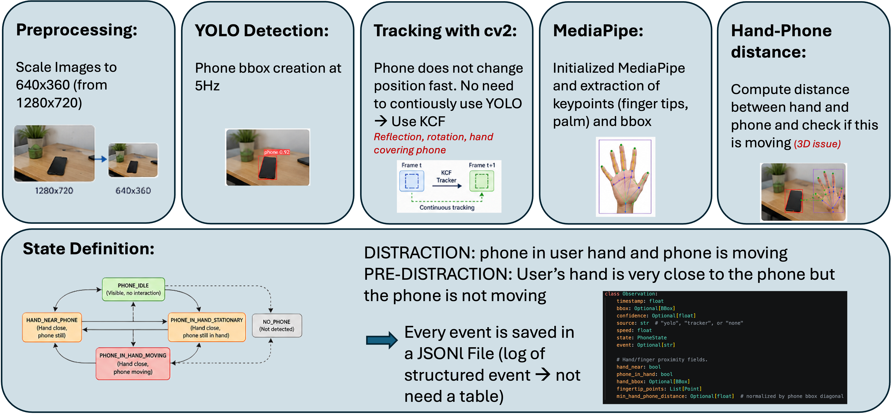

# Focus_Buddy_ReachyMini
Design Focus Buddy: a system in which Reachy Mini acts as a physical productivity companion sitting on the user's desk. The robot observes the workspace through its camera and reacts in real time when it detects that the user has picked up their smartphone during an active focus session.

# Project 
# Focus Buddy - Reachy Mini Productivity Monitor

Focus Buddy is a computer-vision based productivity companion built around **Reachy Mini**. The system observes a desk workspace during an active focus session, detects when the user is about to interact with their smartphone, and triggers expressive robot reactions when a distraction is detected.

The project was designed to satisfy four main goals:

- distinguish between a phone resting on the desk and a phone actively handled by the user;
- react in real time through meaningful robot behavior;
- log distraction events for later review;
- remain lightweight enough for modest hardware.

---

## Pipeline

> Replace the placeholder below with your final pipeline image.

<p align="center">
  
</p>

<!--
Suggested file path:
  docs/images/pipeline.png

Suggested caption:
  End-to-end processing pipeline from raw camera input to robot reaction.
-->

---

## Overview

Focus Buddy combines object detection, visual tracking, hand landmark detection, a small state machine, and robot behavior control.

At a high level:

1. A camera frame is captured from the webcam or robot camera.
2. The frame is resized for efficient processing.
3. YOLO detects the smartphone at low frequency.
4. An OpenCV tracker follows the phone between YOLO detections.
5. MediaPipe detects hand landmarks and fingertip positions.
6. A state machine classifies the phone as resting, hand-near, moving, in-hand, or missing.
7. Events are written to JSONL logs.
8. Reachy Mini reacts with different behavior depending on the detected state.

---

## Key Features

### Hybrid phone monitoring

The system does not run YOLO on every frame. Instead, it uses a hybrid strategy:

- **YOLO** provides robust phone detections at a controlled frequency.
- **OpenCV tracking** updates the phone bounding box between YOLO calls.
- **MediaPipe Hands** estimates whether the user's hand or fingertips are close to the phone.
- A **state machine** converts noisy perception outputs into stable semantic states.

This keeps the loop responsive while reducing CPU/GPU load.

### Distinct intent and distraction states

The project separates two important cases:

| State | Meaning | Robot reaction |
|---|---|---|
| `RESTING` | Phone is visible and stable on the desk | Neutral |
| `HAND_NEAR` | Hand is close to a stable phone | Soft warning |
| `IN_HAND` | Phone is held, moved, or likely picked up | Hard alert |
| `MISSING` | Phone disappeared from view | Possible pickup / occlusion |

This distinction makes the robot less repetitive: it can warn gently when the user is about to pick up the phone, and react more strongly when the phone is actually in hand.

### Reachy Mini reactions

The robot behavior is mapped to perception states:

- **Soft warning** (`HAND_NEAR`): antenna movement, optional small body/base turn, short chirp.
- **Hard alert** (`IN_HAND`): stronger antenna slump/alternation, optional small body/base shake, low descending groan.
- **Neutral reset**: antennas and base return to rest when the phone is put down or the session is paused.

The current implementation deliberately keeps the robot head still and uses antennas, base yaw, and audio for expressive feedback.

### Event logging

Detected events are appended to JSONL files. Each line is a structured event record containing timestamp, state, bounding box, speed, hand proximity, and event type.

Example:

```json
{"timestamp": 1783167845.42, "state": "IN_HAND", "event": "phone_in_hand", "speed": 0.092, "hand_near": true, "phone_in_hand": true}
```

JSONL was chosen because it is append-only, easy to stream during a session, and robust against crashes: previous events remain available even if the program stops unexpectedly.

---

## Repository Structure

```text
.
├── focus_buddy_robot_main.py        # Main integration: monitor + Reachy Mini reactions
├── yolo_detection_hand_intent.py    # Vision pipeline and state machine
├── requirements.txt                 # Python dependencies
├── logs/                            # Runtime event logs, generated automatically
├── docs/
│   └── images/
│       └── pipeline.png             # Add the pipeline image here
└── README.md
```

---

## Main Components

### `HybridPhoneMonitor`

Defined in `yolo_detection_hand_intent.py`.

Responsible for:

- resizing frames for efficient processing;
- running YOLO phone detection;
- initializing and updating the OpenCV tracker;
- running MediaPipe hand detection;
- computing phone motion speed;
- detecting hand-phone proximity;
- updating the phone state machine;
- emitting events.

### `JsonlEventLogger`

Defined in `yolo_detection_hand_intent.py`.

Responsible for writing only meaningful events to a JSONL log file.

### `ReachyMiniReactor`

Defined in `focus_buddy_robot_main.py`.

Responsible for translating perception states into robot behavior while keeping the camera loop responsive. Robot motions are rate-limited and executed asynchronously so that perception does not block while the robot is moving.

### `ConsoleReactor`

Defined in `focus_buddy_robot_main.py`.

Debug fallback used with `--no-robot`. It prints the intended robot reaction without requiring Reachy Mini or the simulator.

---

## Installation

Create and activate a virtual environment:

```bash
python -m venv .venv
source .venv/bin/activate
```

Install dependencies:

```bash
pip install -r requirements.txt
```

Depending on the MediaPipe version, you may also need a local `hand_landmarker.task` file in the project root, or you can pass its path explicitly:

```bash
--hand-landmarker-model path/to/hand_landmarker.task
```

---

## Running the Project

### 1. Vision-only demo

Use this mode to test phone detection, tracking, hand proximity, and the state machine without the robot:

```bash
python yolo_detection_hand_intent.py --camera 0 --model yolo11s.pt
```

Useful keys during the OpenCV window:

| Key | Action |
|---|---|
| `q` | Quit |
| `r` | Reset the monitor |

---

### 2. Robot integration with console fallback

Use this mode to test the full integration logic without connecting to Reachy Mini:

```bash
python focus_buddy_robot_main.py --no-robot --camera 0 --model yolo11s.pt
```

This prints the robot reaction that would have been executed.

---

### 3. Reachy Mini simulator

Start the Reachy Mini simulator in one terminal:

```bash
mjpython -m reachy_mini.daemon.app.main --sim
```

Then run the Focus Buddy robot script in another terminal:

```bash
python focus_buddy_robot_main.py --camera 0 --model yolo11s.pt
```

---

## Useful Runtime Options

### Camera

```bash
--camera 0
--camera-width 1280
--camera-height 720
--camera-fps 30
```

### Detection and tracking

```bash
--model yolo11s.pt
--confidence 0.35
--detection-hz 5
--process-width 640
--yolo-imgsz 320
--tracker KCF
```

### Hand proximity

```bash
--hand-detection-hz 10
--hand-phone-distance-threshold 0.12
--hand-confirm-frames 3
--hand-release-frames 7
```

### Robot behavior

```bash
--no-robot
--no-audio
--no-base-rotation
--soft-repeat-seconds 1.35
--hard-repeat-seconds 3.8
--antenna-amplitude 0.65
```

### Logging

```bash
--log-dir logs
--log-path logs/custom_session.jsonl
```

If `--log-path` is not provided, the main robot script creates a timestamped JSONL file inside `logs/`.

---

## Hardware-Aware Design Choices

The pipeline is designed for continuous execution on modest hardware:

- Frames are resized before processing.
- YOLO is run at low frequency instead of every frame.
- OpenCV tracking provides cheap frame-to-frame updates.
- MediaPipe hand detection runs at its own controlled frequency.
- State transitions require multiple confirmation frames to reduce flicker.
- Robot actions are rate-limited to avoid repeated alerts for the same event.
- Event logging is append-only and lightweight.

---

## Current Limitations

- Phone detection depends on YOLO's ability to see the phone clearly.
- Reflective screens, occlusions, unusual phone orientations, and poor lighting can reduce reliability.
- Hand proximity is heuristic: it uses landmark-to-bounding-box distance rather than a learned interaction model.
- The system currently focuses on one visible phone.
- The robot behavior is manually designed rather than learned from user feedback.

---

## Possible Future Work

- Add a calibration step for the desk area and camera viewpoint.
- Track multiple phones or user-specific objects.
- Add a cloud dashboard for session analytics.
- Store long-term statistics in SQLite or a remote database.
- Add MLOps monitoring for false positives, missed detections, and model drift.
- Use a real Reachy Mini camera stream instead of an external webcam.
- Make the robot gaze follow the phone using bounding-box displacement and camera-to-robot calibration.

---
